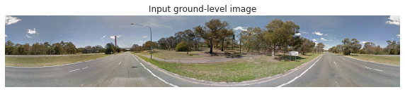
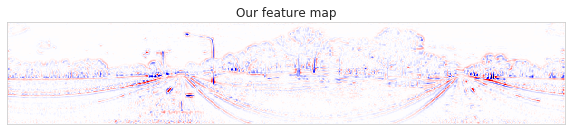
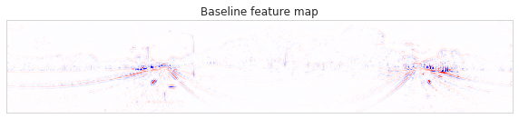
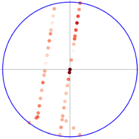
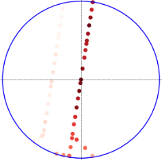
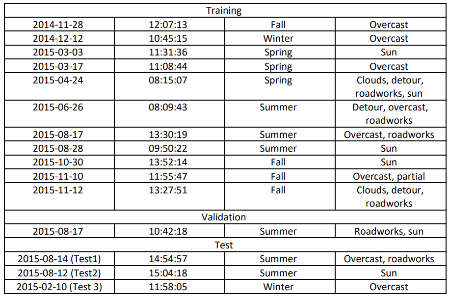

# Visual-Localization-with-Spatial-Prior

### This repository contains code used in
#### "Geographically Local Representation Learning with a Spatial Prior for Visual Localization", ECCV Map-based Localization for Autonomous Driving Workshop 2020
https://link.springer.com/chapter/10.1007%2F978-3-030-66096-3_38
#### "Cross-View Matching for Vehicle Localization by Learning Geographically Local Representations" IEEE Robotics and Automation Letters, 2021
https://ieeexplore.ieee.org/abstract/document/9449965

---------------------------------------------------
## Abstract
We revisit end-to-end representation learning for cross-view self-localization, the task of retrieving for a query camera image the closest satellite image in a database by matching them in a shared image representation space. Previous work tackles this task as a global localization problem, i.e. assuming no prior knowledge on the location, thus the learned image representation must distinguish far apart areas of the map. However, in many practical applications such as self-driving vehicles, it is already possible to discard distant locations through well-known localization techniques using temporal filters and GNSS/GPS sensors. We
argue that learned features should therefore be optimized to be discriminative within the geographic local neighborhood, instead of globally. We propose a simple but effective adaptation to the common triplet loss used in previous work to consider a prior localization estimate already in the training phase. We evaluate our approach on the existing CVACT dataset, and on a novel localization benchmark based on the Oxford RobotCar dataset which tests generalization across multiple traversals and days in the same area. For the Oxford benchmarks we collected corresponding satellite images. With a localization prior, our approach improves recall@1 by 9 percent points on CVACT, and reduces the median localization error by 2.45 meters on the Oxford benchmark, compared to a state-of-the-art baseline approach. Qualitative results underscore that with our approach the network indeed captures different aspects of the local surroundings compared to the global baseline.

Given an input image, our model extracts feature at geographical local discriminative objects, e.g. streetlights and vegetations, while the baseline mostly focuses on the road structure, which is globally distinct, but locally ambiguous.

 

Consequently, our model is more discriminative in local areas. In the above localization heat maps, each dot represents a satellite image, and the ground truth location is indicated by the cross. Darker colors indicate smaller embedding distance between the satellite images at those locations and the ground query taken at the center location. Inside a local neighborhood with a 100m radius, our approach results in a single peak (left), while the baseline distribution is more spread (right).

## CVACT Dataset
The CVACT dataset can be accessed from: https://github.com/Liumouliu/OriCNN
Please download both ACT_small and ACT_test and put them together to form the dataset we use.

## Oxford RobotCar Dataset
We collected satellite images for Oxford RobotCar dataset (https://robotcar-dataset.robots.ox.ac.uk/). The link to our collected satellite images: https://surfdrive.surf.nl/files/index.php/s/kF4NlGOeQT1sIpV

The overview of the traversals we use:

## Models
Models used in the ECCVw and RAL paper can be find through the link: https://drive.google.com/drive/folders/1c65BThElwZAN0Pqzdqfn8jJ11LcD8Hse?usp=sharing

## Codes
For training and validation the proposed method, run: CVACT_training_and_validation_our_model.ipynb
For training and validation the baseline, run: CVACT_training_and_validation_baseline.ipynb

please first run the pre-processing strp provided by the baseline, https://github.com/shiyujiao/cross_view_localization_SAFA, to get the polar transformed satellite image.

## Notes
if you use this code in your research, please cite our paper:

@InProceedings{10.1007/978-3-030-66096-3_38,
author="Xia, Zimin
and Booij, Olaf
and Manfredi, Marco
and Kooij, Julian F. P.",
editor="Bartoli, Adrien
and Fusiello, Andrea",
title="Geographically Local Representation Learning with a Spatial Prior for Visual Localization",
booktitle="Computer Vision -- ECCV 2020 Workshops",
year="2020",
publisher="Springer International Publishing",
address="Cham",
pages="557--573"
}

@ARTICLE{9449965,
  author={Xia, Zimin and Booij, Olaf and Manfredi, Marco and Kooij, Julian F. P.},
  journal={IEEE Robotics and Automation Letters}, 
  title={Cross-View Matching for Vehicle Localization by Learning Geographically Local Representations}, 
  year={2021},
  volume={6},
  number={3},
  pages={5921-5928},
  doi={10.1109/LRA.2021.3088076}}
